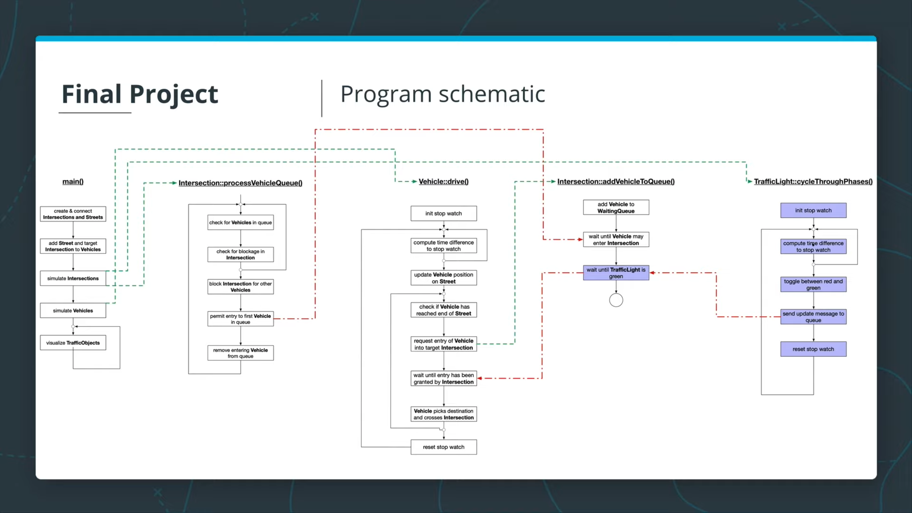

# Concurrent Traffic Simulation

This is the project for the fourth course in the [Udacity C++ Nanodegree Program](https://www.udacity.com/course/c-plus-plus-nanodegree--nd213): Concurrency.

## Contribution
- `src/TrafficObject.cpp`
- `src/Vehicle.cpp`
- `src/Intersection.cpp`
- `src/TrafficLight.cpp`

## Build Instructions
1. Run `make build` and `cd build`
1. Run: `./traffic_simulation`.

## My Simulation Result

## Project Schematic

